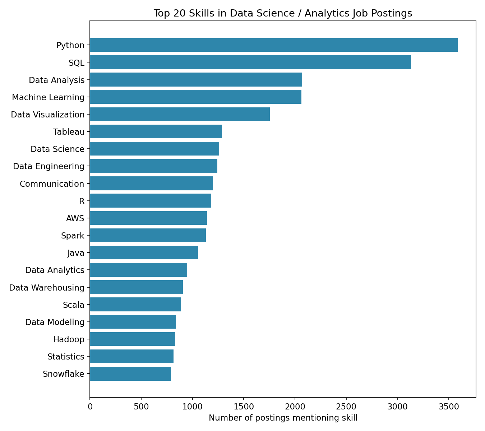

# What Skills Actually Get You Hired in Data Science?

An analysis of 5,636 real Data Scientist / Data Engineer / Data Analyst / ML Engineer job postings (LinkedIn, Jan 2024) to answer: what skills actually show up in job requirements, and how does that differ by role and seniority?

**[Read the full report →](REPORT.md)**

## Key findings

- **Python (64%) and SQL (56%)** dominate every role — the real baseline before any ML-specific skill
- **Skill demand is role-specific**, not one universal list: Data Engineers need Spark/Scala/Snowflake, Data Scientists need R/Statistics, Analysts need Tableau/Power BI, ML Engineers need TensorFlow/PyTorch
- **Junior vs. senior postings ask for nearly the same skills** — seniority changes required years of experience more than which tools you need
- **AWS (1,126 mentions) leads Azure (587) and GCP (~520) combined** among cloud platforms



## Repo structure

```
├── REPORT.md              # Full write-up with all findings & caveats
├── outputs/                # Generated charts
│   ├── 01_top_skills.png
│   ├── 02_skills_by_role.png
│   ├── 03_cooccurrence_heatmap.png
│   └── 04_skills_by_seniority.png
├── scripts/
│   ├── analysis.py         # Merge, filter to DS-relevant roles, explode skills
│   ├── analysis2.py        # Role categorization + synonym cleanup
│   └── viz.py               # All chart generation
└── requirements.txt
```

## Data source

[Data Science Job Postings & Skills](https://www.kaggle.com/datasets/asaniczka/data-science-job-postings-and-skills) (Kaggle, by asaniczka). Not redistributed here due to size/licensing — download the three CSVs (`job_postings.csv`, `job_skills.csv`, `job_summary.csv`) from the link above and place them in a `data/` folder to reproduce.

## Reproducing this analysis

```bash
pip install -r requirements.txt
# place job_postings.csv and job_skills.csv in data/
python scripts/analysis.py
python scripts/analysis2.py
python scripts/viz.py
```

## Caveats

- Dataset is heavily US/UK-skewed (84% US postings) — not a global or EU-specific signal
- Point-in-time snapshot (Jan 2024), not a trend analysis
- Skills were extracted via the dataset's pre-built NER pipeline, not custom-built here — long-tail noisy tags were filtered out

## Author

Built by [your name] as a data analysis project. Feedback welcome — open an issue or connect on [LinkedIn].
