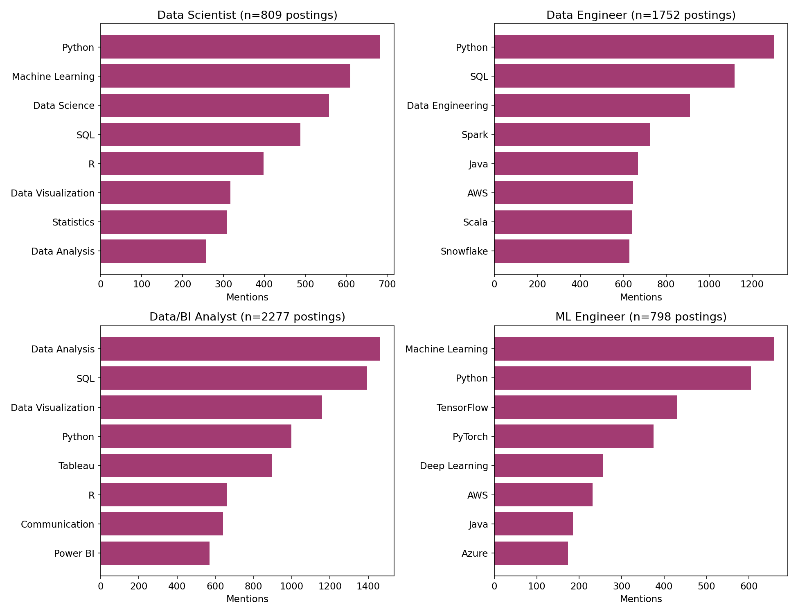
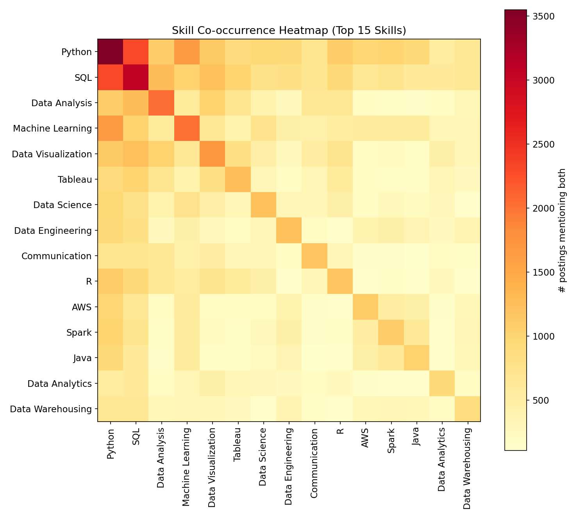
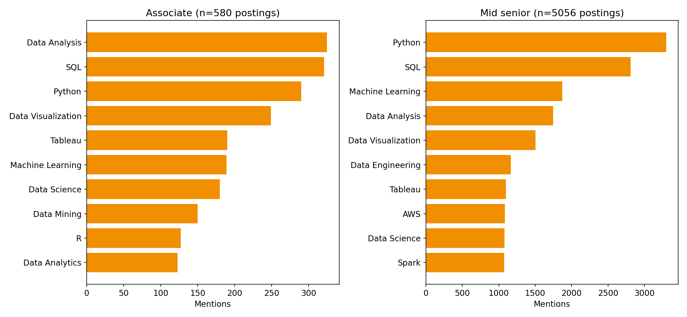

# What Skills Actually Get You Hired in Data Science? (2024 LinkedIn Job Postings Analysis)

**Dataset:** 12,217 LinkedIn job postings (Kaggle, asaniczka/data-science-job-postings-and-skills, collected Jan 2024)
**Filtered to:** 5,636 postings with titles matching Data Scientist, Data Engineer, Data Analyst, or ML Engineer
**Method:** NER-extracted skill tags per posting, exploded and normalized, then analyzed for frequency, co-occurrence, role differences, and seniority differences.

---

## 1. The Overall Top 20

Python and SQL dominate — appearing in **64%** and **56%** of all postings respectively. That's a bigger gap than most "learn ML" advice implies: before TensorFlow or Spark, the baseline expectation is fluent Python + SQL.

Notable: "soft" tags like *Communication* (1,196 mentions) rank above many technical tools like Hadoop or Statistics — recruiters/NER pipelines are explicitly tagging soft skills as first-class requirements, not afterthoughts.

## 2. Skill Demand Is Role-Specific — a Single "Data Skills" List Is Misleading

Breaking postings into four role buckets shows genuinely different skill profiles, not just the same list reshuffled:

- **Data Scientist** → Python, Machine Learning, Data Science, SQL, **R** (R barely shows up for other roles)
- **Data Engineer** → Python, SQL, Data Engineering, **Spark, Java, Scala, Snowflake** — this is the only role where JVM languages and big-data infra tools dominate
- **Data/BI Analyst** → Data Analysis, SQL, **Data Visualization, Tableau, Power BI** — the only role where BI tools crack the top list
- **ML Engineer** → Machine Learning, Python, **TensorFlow, PyTorch, Deep Learning** — the only role where deep learning frameworks appear at all in the top 8

**Practical takeaway:** if you're optimizing a resume for "Data Scientist" roles specifically, Spark/Scala/Snowflake experience (common Data Engineer asks) won't move the needle nearly as much as R and statistics will.

## 3. What Pairs With What

The strongest pairings outside the diagonal: **Python↔SQL** and **Python↔Machine Learning**. Interestingly, R and Tableau are both fairly isolated — postings asking for R rarely also ask for Tableau/Power BI, suggesting R-heavy roles skew more toward statistical/research work than dashboard-building.

## 4. Junior vs. Senior: The List Barely Changes

This is arguably the most useful finding for a beginner: the top skills for **Associate**-level postings (n=580) and **Mid-senior**-level postings (n=5,056) are nearly identical — Python, SQL, Data Analysis, Data Visualization all appear near the top of both. Seniority mostly changes *scope and years required*, not *which tools you need to know*. There's no secret advanced toolkit gatekeeping junior roles — the fundamentals (Python, SQL, data viz) are the actual bar at every level in this dataset.

## 5. Cloud Platforms: AWS Still Leads

Among the three major cloud providers explicitly tagged: **AWS (1,126 postings) > Azure (587) > GCP (~520 combining "GCP"/"Google Cloud" variants)**. AWS is mentioned roughly 2x as often as Azure and Google Cloud combined.

---

## Data insights

- **Data is US/UK/Canada/Australia-heavy** — 84% US postings, no continental Europe representation, so this isn't a Hungary/EU-specific signal despite the original framing. Worth rerunning against an EU-specific job board if that matters for your job search.
- **Point-in-time snapshot** (Jan 2024) — this is not a trend analysis; skill demand shifts, especially anything AI-related.
- **NER extraction is noisy** — skill tags include everything from "Python" to "Ability to work in a fast-growing environment," so the long tail (18,874 skills mentioned only once) was excluded from the main analysis to keep signal clean.
- **Correlation, not causation** — high mention frequency reflects what employers *list*, not necessarily what actually gets people hired.

## Files
- `outputs/01_top_skills.png` – overall top 20 skills
- `outputs/02_skills_by_role.png` – skill breakdown by role category
- `outputs/03_cooccurrence_heatmap.png` – which skills travel together
- `outputs/04_skills_by_seniority.png` – associate vs. mid-senior comparison
- `exploded_skills_v2.csv` – full cleaned dataset (one row per skill mention)
- `analysis.py`, `analysis2.py`, `viz.py` – reproducible pipeline
